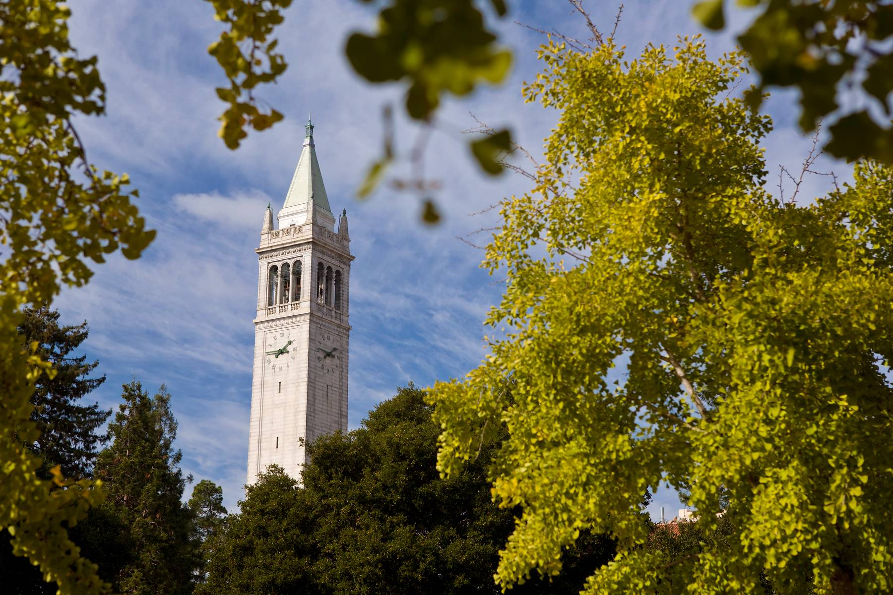

---
title: "Experimental Designs in the Era of Artificial Intelligence"
---

We are excited to have you at the **2025 Experimental Designs in the Era of Artificial Intelligence Workshop**, which will take place on **March 7-8, 2025**, at the **Berkeley Alumni House**, UC Berkeley.

This workshop will gather experts to explore recent advancements in experimental design and their applications in this era of artificial intelligence. 

  <!-- Adjust the width as needed -->

### Key Information:
- **Dates**: March 7-8, 2025
- **Location**: Berkeley Alumni House, UC Berkeley

### Speakers
We are honored to feature the following speakers for this workshop, listed in alphabetical order:

- Tianxi Cai, *Harvard University*
- Feifang Hu, *George Washington University*
- Anastasia Ivanova, *University of North Carolina at Chapel Hill* 
- Yuan Ji, *University of Chicago*
- Luke Keele, *University of Pennsylvania*
- Michael Kosorok, *University of North Carolina at Chapel Hill*
- Mark van der Laan, *University of California, Berkeley*
- Annie Qu, *University of California, Irvine*
- Lu Tian, *Stanford University*
- Boxin Tang, *Simon Fraser University*
- Lorenzo Trippa, *Harvard University*
- Sofia S. Villar, *University of Cambridge*
- Alexander Volfovsky, *Duke University*
- Waverly Wei, *University of Southern California *
- Bin Yu, *University of California, Berkeley*
- Yuan Ying, *MD Anderson Cancer Center*
- Hongyu Zhao, *Yale University*
- Hongtu Zhu, *University of North Carolina at Chapel Hill*

### Organizers

- **Jingshen Wang**, UC Berkeley
- **Junzhe Shao**, UC Berkeley (student member)
- **Rita Qiuran Lyu**, UC Berkeley (student member)
- **Lei Shi**, UC Berkeley (student member)
- **Xinrui Ruan**, UC Berkeley (student member)

---

Registration is closed. Please note as an invited speaker or an invited guest, you **do not** need to register. 

---
