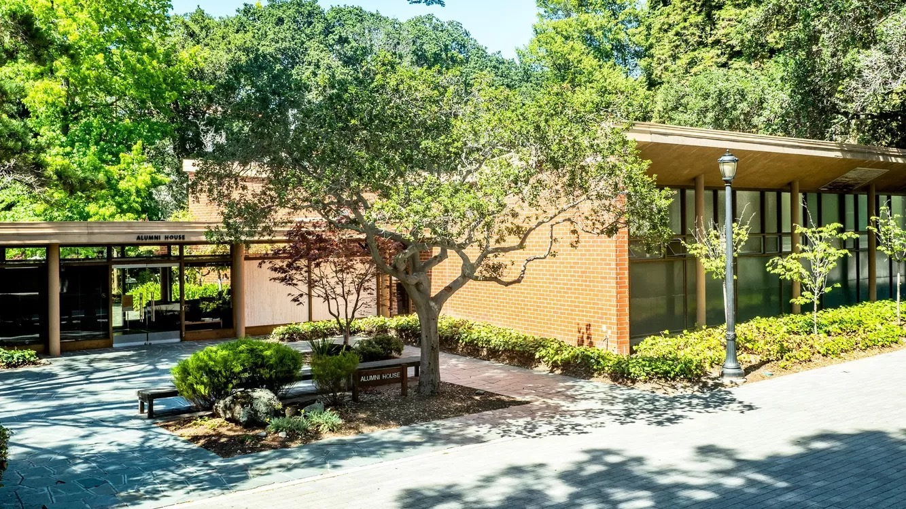

## Workshop Location

The workshop will be held at the [**Berkeley Alumni House**](https://alumni.berkeley.edu/cal-spirit/alumni-house/), located on the UC Berkeley campus.    

**Address**:  
Berkeley Alumni House   
1 Alumni House  
Berkeley, CA 94720, USA

  <!-- Adjust the width as needed -->

---

## Accommodation

Another UC Berkeley-affiliated event is scheduled for the weekend of March 7th, 2025. We recommend booking early due to limited availability:

### Hotels

1. **The Faculty Club**
   - **Address**: UC Berkeley, Minor Ln, Berkeley, CA 94720
   - **Distance**: 8-minute walk to Berkeley Alumni House
   - **Website**: [Faculty Club](https://www.berkeleyfacultyclub.com/)
   
2. **Marriott Residence Inn Berkeley**
   - **Address**: 2121 Center St, Berkeley, CA 94704
   - **Distance**: 10-minute walk to Berkeley Alumni House
   - **Website**: [Residence Inn Berkeley](https://www.marriott.com/en-us/hotels/oakrr-residence-inn-berkeley/overview/?scid=f2ae0541-1279-4f24-b197-a979c79310b0)

---

# Transport Information

The UC Berkeley campus is easily accessible by public transportation. Below are a few options:

### From San Francisco International Airport (SFO):
- **BART (Bay Area Rapid Transit)**: Take the Yellow Line from SFO to Downtown Berkeley Station (approx. 60 minutes). Berkeley Alumni House is a 15-minute walk from the station.
- **Uber/Lyft**: Approx. 30-minute drive, depending on traffic.

### From Oakland International Airport (OAK):
- **BART**: Take the Orange Line from Oakland Airport to Downtown Berkeley Station (approx. 45 minutes).
- **Uber/Lyft**: Approx. 20-minute drive, depending on traffic.

### Parking Options:
If you are driving, we recommend parking at the **Underhill Parking Facility** (12-minute walk to Berkeley Alumni House) located at 2610 Haste Street, Berkeley, CA 94704.

---

For more details, check out the [UC Berkeley Campus Map](https://www.berkeley.edu/map).
